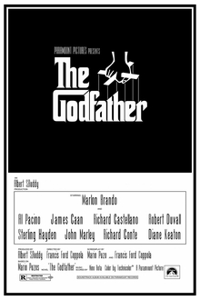

# app-dev
My first repository
## **My Favorite Movies**

1. GodFather
   a trilogy of American crime :tophat: films directed by Francis Ford Coppola inspired by the 1969 novel of the same name by Italian American author Mario Puzo.
   The films follow the trials of the fictional Italian American mafia Corleone family whose patriarch, Vito Corleone, rises to be a major figure in American organized crime:facepunch:.
